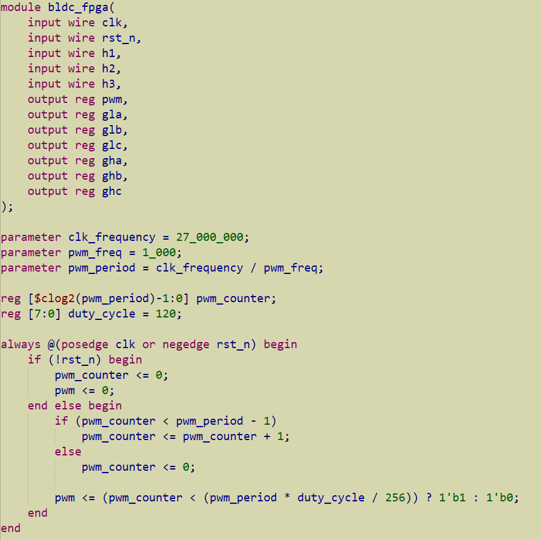
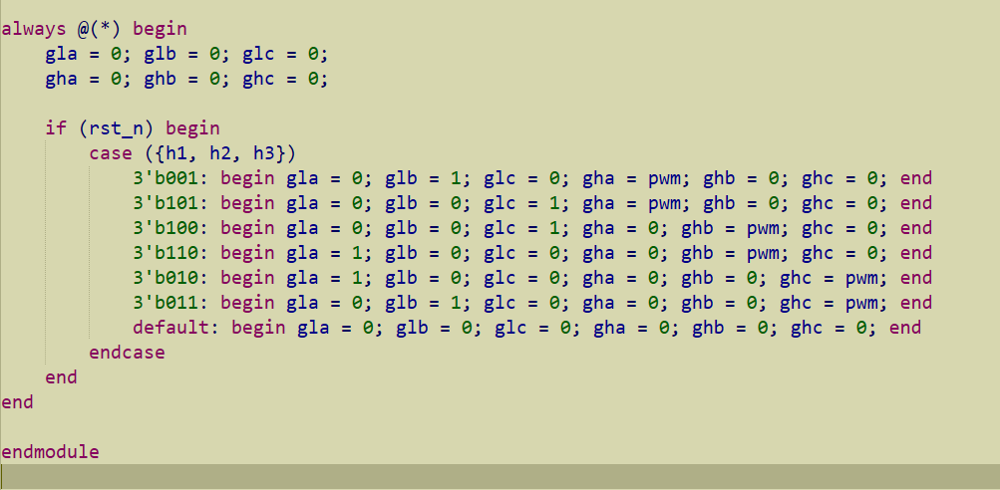

# BLDC Motor Controller using FPGA
This repository contains my individual contribution to a group project where we implemented a BLDC motor controller using FPGA and hall sensor feedback.
- [Watch Demo on YouTube](https://www.youtube.com/shorts/Jrmsi-v2h4o)
- This is the circuit diagram of our project.

- First, I created a PWM signal of 1 kHz using clock frequency of 27 MHz of the FPGA (Tang Nano 4k).

- Then using hall sensors input I programmed FPGA to implement six step commutation logic for Gate driver ICs (IR2110).

- We tested out setup using oscilloscope and integrated with out FPGA.
